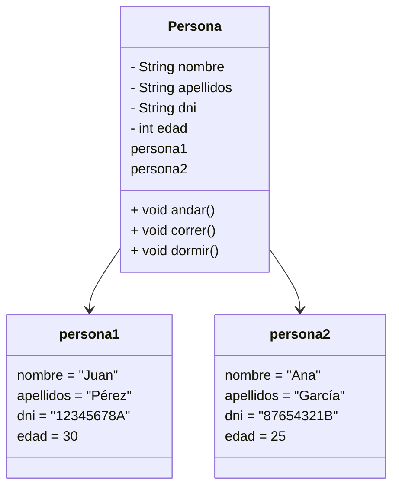
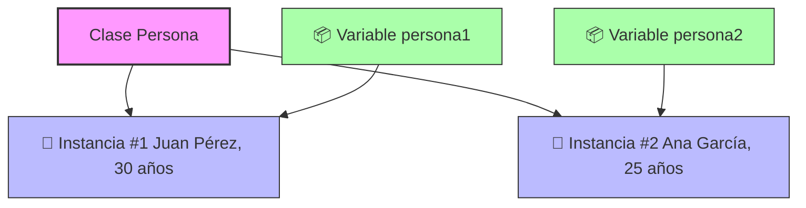

### 🔧 **Framework**

Un **framework** es una base de código reutilizable que ya incluye herramientas, librerías y soluciones comunes. Sirve como “esqueleto” para crear aplicaciones más rápido, permitiendo a los desarrolladores centrarse en la lógica específica de su aplicación en lugar de empezar desde cero. 

---

### ☕️ **Java Method**

Un **método en Java** es un bloque de código que realiza una tarea. Se puede llamar cuando se necesite para evitar repetir código.

---

### 🔐 **Modificadores de acceso**

- **public**: accesible desde cualquier parte.
    
- **protected**: accesible desde el mismo paquete y subclases.
    
- **(package)**: accesible solo desde el mismo paquete (sin modificador).
    
- **private**: accesible solo desde la misma clase.
    

---

### ⚖️ **static vs no static**

- **static**: se accede desde la clase directamente (ej. `Math.random()`).
    
- **no static**: necesitas crear un objeto de la clase para usarlo.
    

---

### 🔁 **void vs otros retornos**

- **void**: el método no devuelve nada.
    
- Otros tipos (como `int`, `String`, etc.): el método devuelve un valor de ese tipo.
    

---

### 🧠 **Paso por valor vs referencia**

- **Primitivos**: se pasan **por valor** (se copia el valor).
    
- **Objetos**: se pasan **por referencia** (se pasa la dirección del objeto).
    

---

### 🧾 **Main con argumentos**

Puedes pasar argumentos al método `main` desde la línea de comandos o configurarlo en Eclipse.

---

### 🧩 **Llamar métodos desde estáticos**

Desde un método `static` **solo puedes llamar a otros métodos `static`**, a menos que crees un objeto.

---

### 📦 **Variables fuera de métodos**

Si una variable está fuera de los métodos (es decir, es de clase), debe ser `static` para usarse dentro de un método `static`.

---

### 🔁 **Recursividad**

Un método puede **llamarse a sí mismo**. Esto se llama recursividad.

---

### ➕ **Sobrecarga de métodos**

Un método puede estar **sobrecargado**, es decir, tener el mismo nombre pero distintos parámetros.

---

### 📈 **Math.pow()**

`Math.pow(x, y)` calcula la **potencia**: x elevado a y.

---

### 📥 **Import estático**

En Java, un **import estático** (o _static import_) es una característica que permite **acceder directamente a miembros estáticos** (atributos o métodos estáticos) de una clase **sin necesidad de anteponer el nombre de la clase** cada vez que los usas.

`import static nombre_del_paquete.NombreDeLaClase.nombre_estático;`

También puedes importar **todos** los miembros estáticos de una clase usando `*`:

`import static nombre_del_paquete.NombreDeLaClase.*;`

---

### Método `split()`

El método `split()` permite dividir un string en partes y devolverlas como un array de strings. En clase lo utilizamos para invocar directamente un método que requería un array de strings, partiendo desde un único string.

---

### Tipos de Variables

- **Variable global / Variable de instancia:** Son las variables declaradas dentro de una clase pero fuera de cualquier método. Aunque se las llama "globales", en realidad pertenecen a cada instancia del objeto.
    
- **Variable local:** Se declara dentro de un método y solo puede usarse dentro de ese método.
    
- **Variable `final`:** Es una variable cuyo valor no puede cambiar una vez asignado.  
    Ejemplo de sintaxis:
    
    `final static int opcion = 9;`
    

---

### Programación Orientada a Objetos (PPOO)

Conjunto de principios que organiza el código en torno a objetos. Sus pilares son:

- **Herencia:** Permite que una clase herede atributos y métodos de otra.
    
- **Polimorfismo:** Permite que un mismo método se comporte de diferentes maneras según el objeto que lo invoque.
    
- **Encapsulación:** Consiste en ocultar los detalles internos de una clase y exponer solo lo necesario mediante métodos públicos.
    
- **Abstracción:** Permite trabajar con ideas generales (clases abstractas o interfaces), ocultando la implementación concreta.
    

---

### Clases y Objetos en Java

- En Java, un **objeto** es una instancia de una clase. Para crear un objeto, primero se debe definir una clase.
    
- Una **clase** puede contener:
    
    - **Variables de instancia**: son sus atributos, accesibles por cada objeto.
        
    - **Métodos estáticos**: pertenecen a la clase y se invocan sin crear un objeto.
        
    - **Métodos de instancia**: pertenecen a los objetos creados a partir de la clase.
        
- Los objetos se instancian en la **JVM** (Java Virtual Machine) usando una clase.
    
- El **constructor por defecto** de una clase se encarga de inicializar las variables de instancia con sus valores predeterminados.

