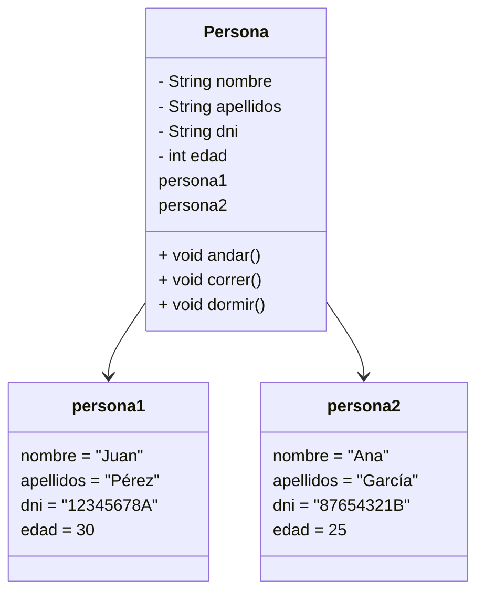
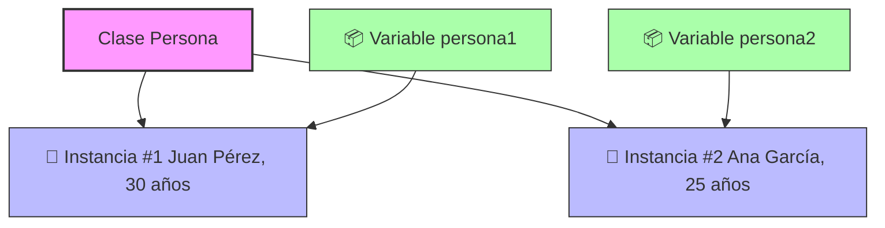

*Un framework, o marco de trabajo, es una estructura o plantilla reutilizable de código y herramientas que proporciona una base para desarrollar software de manera más rápida, eficiente y organizada. Actúa como un esqueleto con librerías, convenciones y soluciones predefinidas para problemas comunes, permitiendo a los desarrolladores centrarse en la lógica específica de su aplicación en lugar de empezar desde cero.* 

*A Java method is a block of code that performs a specific task and can be called (or invoked) when needed.*

*Public, protected, (package), private*

*static vs NOT static*
*para usar los estáticos llamamos a la clase y luego al método concreto (math.random por ejemplo)*

*void vs otros retornos*

*paso por referencia (objetos) vs paso por valor (primitivos)*

*se puede invocar al main pasándole los argumentos desde la línea de comando o en eclipse al configurar el menú correspondiente*

*para llamar a un método desde un método estático el método desde el que se le llama también ha de ser estático* 

*para usar variables que están fuera de los métodos estos han de ser estáticos*

*un método se puede llamar a si mismo* 

*un método se puede sobrecargar*

*el método pow (Math.pow(numero, potencia)) es la potencia* 

*En Java, un **import estático** (o static import) es una característica que permite **acceder directamente a miembros estáticos** (atributos o métodos estáticos) de una clase **sin necesidad de anteponer el nombre de la clase** cada vez que los usas.*

*`import static nombre_del_paquete.NombreDeLaClase.nombre_estático;`*

*También puedes importar **todos** los miembros estáticos de una clase usando `*`:*

*`import static nombre_del_paquete.NombreDeLaClase.*;`*

---

el método split() permite crear un array de strings a partir de un string. durante la clase la usamos para invocar directamente a partir de un string un método que necesitaba un array de strings 

variable global / variable de instancia vs variable local

variable final. ejemplo final syntax: final static int opcion=9.

PPOO

Herencia
Polimorfismo
Encapsulacion
Abstraccion

En Java, un objeto es una instancia de una clase, por ello has de definir una clase para poder crear un objeto.

Una clase tiene variables propias que son globales pero a las que llamamos variables de instancia.

Una clase puede tener métodos estáticos y una instancia puede tener métodos de instancia.

Se instancias objetos en la JVM a través de una clase.

El constructor por defecto de una clase inicializa las variables de instancia con sus valores por defecto.

