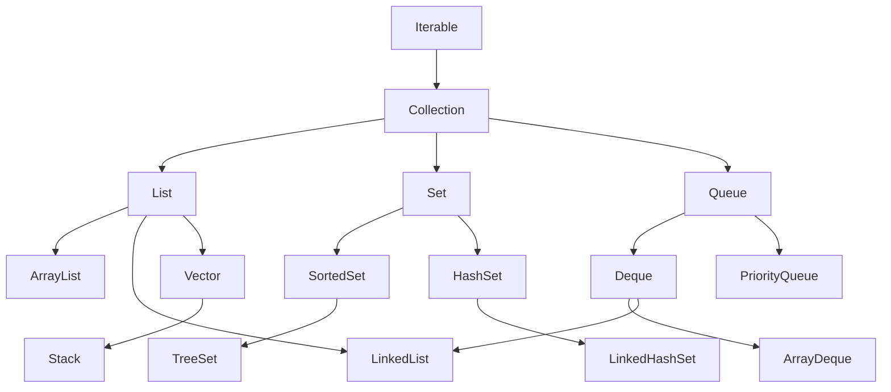

# PPOO

## Método sleep

**¿Qué hace?**  
`Thread.sleep(long millis)` es un método que pausa la ejecución del hilo actual durante un tiempo determinado (en milisegundos). En tu ejemplo, `Thread.sleep(10000);` hace que el programa se detenga durante 10 segundos (10,000 milisegundos).

**¿Para qué sirve?**  
Se usa para simular retardos, esperas, o simplemente para hacer una pausa en la ejecución, por ejemplo, para esperar a que se complete una tarea externa o para simular un tiempo de procesamiento.

---

## Declaracion rapida de Array ejemplo

```java
mp.metodoPago(new Pago[]{pagoPaypal, pagoTarjeta, pagoTransferencia});
```

---

## Bloque try-catch

**¿Qué es?**  
En Java, ciertas operaciones pueden lanzar excepciones (errores en tiempo de ejecución). `Thread.sleep` puede lanzar una excepción llamada `InterruptedException` si otro hilo interrumpe el hilo mientras está dormido.

**¿Cómo se maneja?**  
Para manejar estas excepciones, Java utiliza el bloque `try-catch`. Se pone el código que puede lanzar una excepción dentro del `try`, y si la excepción ocurre, se captura en el bloque `catch` donde podemos decidir qué hacer (registrar el error, recuperarnos, etc.).

**Ejemplo:**

```java
try {
    Thread.sleep(10000);
} catch (InterruptedException e) {
    e.printStackTrace();
}
```


Esto significa: "Intento pausar el hilo 10 segundos, y si alguien interrumpe ese sueño, captura la excepción y muestra el error en la consola."

---

## Excepciones verificadas (checked exceptions)

Son aquellas excepciones que el compilador obliga a manejar o declarar en el método, porque representan condiciones que pueden ocurrir durante la ejecución y que el programa debe prever. Si un método lanza una excepción verificada, debes usar un bloque `try-catch` para capturarla o declarar con `throws` que tu método también puede lanzarla. Ejemplos comunes incluyen `IOException` y `InterruptedException`.

---

## Encapsulamiento en Clases con la Misma Interfaz

Cuando varias clases implementan el mismo **interfaz**, todas deben definir los métodos que la interfaz declara, asegurando que tengan un comportamiento común. Sin embargo, cada clase puede tener **sus propias variables privadas**, que solo están disponibles dentro de esa clase.

Estas variables privadas permiten que cada clase mantenga su propio estado interno, diferente de las otras, y que solo sus métodos puedan acceder o modificar esos datos. De esta forma, aunque compartan la misma estructura externa (los métodos de la interfaz), internamente pueden funcionar y almacenar información de manera independiente y específica.

---

## Llamar métodos no estáticos desde métodos estáticos en Java

En Java, los métodos estáticos no pueden acceder directamente a métodos no estáticos porque estos últimos pertenecen a instancias específicas de la clase. Por lo tanto, para llamar a un método no estático desde un método estático, primero es necesario crear un objeto (una instancia) de la clase y luego usar ese objeto para invocar el método no estático.

El método `main` es un método estático por definición, por lo que solo puede llamar directamente a otros métodos estáticos. Si dentro de `main` se necesita llamar a un método no estático, como en el caso del método privado `metodoPago`, es necesario crear un objeto de la clase (por ejemplo, `MainPagos`) y usar ese objeto para invocar dicho método.

**Ejemplo:**

```java
public class Ejemplo {

    public static void main(String[] args) {
        Ejemplo obj = new Ejemplo();  // Crear instancia
        obj.metodoNoEstatico();       // Llamar método no estático
    }

    private void metodoNoEstatico() {
        System.out.println("Este es un método no estático");
    }
}
```

En este ejemplo, el método `main` crea una instancia de la clase `Ejemplo` y llama al método no estático `metodoNoEstatico` usando esa instancia.

---

## Colecciones

Hasta ahora hemos usado Arrays:

- Tienen un tamaño fijo, solo permiten almacenar un número concreto de elementos.
    
- Almacenan elementos de un solo tipo.
    

En cambio, las colecciones permiten tamaños dinámicos y, generalmente, almacenan elementos de un tipo específico, definido mediante genéricos. Si se desea, pueden almacenar diferentes tipos usando tipos generales como `Object`, aunque no es la práctica recomendada.

Java las incluye en el paquete de Java Standard Edition.

---

## Interfaces y Clases de la API de Colecciones en Java




La API de colecciones de Java proporciona interfaces y clases que permiten almacenar, organizar y manipular grupos de objetos de forma flexible y eficiente.

### Principales Interfaces

- **Iterable**  
    Es la interfaz raíz de todas las colecciones. Permite recorrer sus elementos usando un bucle `for-each`.
    
- **Collection**  
    Extiende `Iterable`. Define operaciones básicas como `add()`, `remove()`, `size()`, etc. Todas las colecciones estándar implementan esta interfaz.
    
- **List**  
    Extiende `Collection`. Representa una colección ordenada que permite elementos duplicados y acceso por índice. Ejemplo: `ArrayList`, `LinkedList`.
    
- **Queue**  
    Extiende `Collection`. Representa una estructura de datos tipo cola (FIFO). Ejemplo: `PriorityQueue`, `ArrayDeque`.
    
- **Deque**  
    Extiende `Queue`. Es una cola doble: permite insertar y eliminar elementos por ambos extremos. Ejemplo: `ArrayDeque`, `LinkedList`.
    
- **Set**  
    Extiende `Collection`. Representa una colección que no permite elementos duplicados. Ejemplo: `HashSet`, `TreeSet`.
    
- **SortedSet**  
    Extiende `Set`. Representa un conjunto ordenado según el orden natural de los elementos o un comparador. Ejemplo: `TreeSet`.
    

---

### Principales Clases que Implementan Colecciones

- **ArrayList**  
    Implementa `List`. Usa un array interno redimensionable. Ofrece acceso rápido por índice, pero inserciones y eliminaciones intermedias son más costosas.
    
- **LinkedList**  
    Implementa `List` y `Deque`. Usa una lista doblemente enlazada. Buena para inserciones y eliminaciones frecuentes.
    
- **Vector**  
    Similar a `ArrayList`, pero **sincronizado** (seguro para múltiples hilos). Hoy en día, es menos usado.
    
- **Stack**  
    Hereda de `Vector`. Implementa una **pila** (LIFO). Se puede reemplazar por `Deque` para un mejor rendimiento.
    
- **PriorityQueue**  
    Implementa `Queue`. Es una cola de prioridad: los elementos se ordenan automáticamente según su prioridad (orden natural o personalizado).
    
- **ArrayDeque**  
    Implementa `Deque`. Es una estructura eficiente para operaciones en ambos extremos. Más rápida que `Stack` y `LinkedList` para pilas y colas.
    
- **HashSet**  
    Implementa `Set`. Usa una tabla hash. No garantiza orden. Muy eficiente para operaciones de búsqueda y eliminación.
    
- **LinkedHashSet**  
    Similar a `HashSet`, pero mantiene el orden de inserción de los elementos.
    
- **TreeSet**  
    Implementa `SortedSet`. Almacena los elementos ordenados. Usa un árbol rojo-negro internamente.

---

### Métodos `add`, `size` y `get` en la interfaz `List`

```java
import java.util.List;
import java.util.ArrayList;

public class EjemploList {
    public static void main(String[] args) {
        List<String> nombres = new ArrayList<>();

        // add: añade elementos al final de la lista
        nombres.add("Ana");
        nombres.add("Luis");
        nombres.add("María");

        // size: devuelve la cantidad de elementos en la lista
        System.out.println("Tamaño de la lista: " + nombres.size());  // 3

        // get: obtiene el elemento en una posición específica (índice)
        System.out.println("Elemento en posición 1: " + nombres.get(1));  // Luis
    }
}
```

Descripción:
 - `add(elemento)`: Añade un elemento al final de la lista.
 - `size()`: Retorna el número total de elementos en la lista.
 - `get(indice)`: Devuelve el elemento en la posición indicada (empieza en 0).

---

### Genéricos en Java

Los **genéricos** permiten crear clases, interfaces y métodos que trabajan con tipos de datos parametrizados. Ofrecen mayor seguridad de tipos y reutilización de código, evitando conversiones manuales y errores en tiempo de ejecución.

#### Ejemplo con List

```java
List<String> nombres = new ArrayList<>();
nombres.add("Ana");
String nombre = nombres.get(0); // No necesita cast
```

Sin genéricos, se requería hacer un cast manual:

```java
List nombres = new ArrayList();
nombres.add("Ana");
String nombre = (String) nombres.get(0); // Cast manual
```

#### Genéricos personalizados

```java
public class Caja<T> {
    private T contenido;

    public void guardar(T valor) {
        contenido = valor;
    }

    public T obtener() {
        return contenido;
    }
}

// Uso
Caja<Integer> caja = new Caja<>();
caja.guardar(123);
int valor = caja.obtener();
```

Los genéricos hacen posible escribir código más limpio, seguro y reutilizable al trabajar con diferentes tipos de datos sin duplicar clases o métodos.

